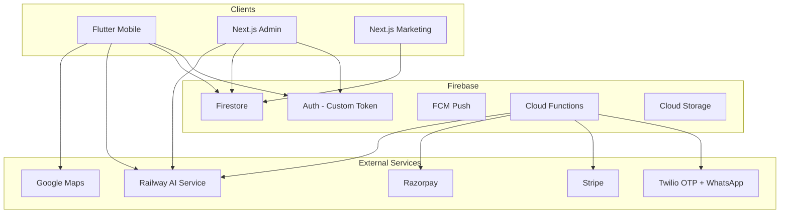

# Architecture Overview

## System Context



## Layers

| Layer | Responsibility |
|-------|----------------|
| **Presentation** | Flutter mobile, Next.js admin/marketing |
| **Application** | Riverpod providers, Next.js server actions |
| **Domain** | `@ai-school/shared` — permissions, pricing, features |
| **Infrastructure** | Firebase, Railway, Twilio, payment gateways |

## Multi-Tenancy

- Every school is a **tenant** (`tenants/{tenantId}`)
- Users link via **memberships** (`memberships/{userId}_{tenantId}`)
- All school data carries `tenantId` for isolation
- Firestore rules enforce tenant + role boundaries

## Clean Architecture (Mobile)

```
lib/
├── core/           # Router, theme, auth, network
├── features/       # Feature modules (auth, bus, ai, ...)
│   └── {feature}/
│       ├── data/
│       ├── domain/
│       └── presentation/
└── shared/         # Widgets, models
```

## Scalability

- Firestore composite indexes for tenant-scoped queries
- Feature flags gate modules per subscription
- AI workloads isolated on Railway (horizontal scale)
- CDN for marketing via Vercel/Cloudflare
- Offline: Hive cache + Firestore persistence (mobile)
