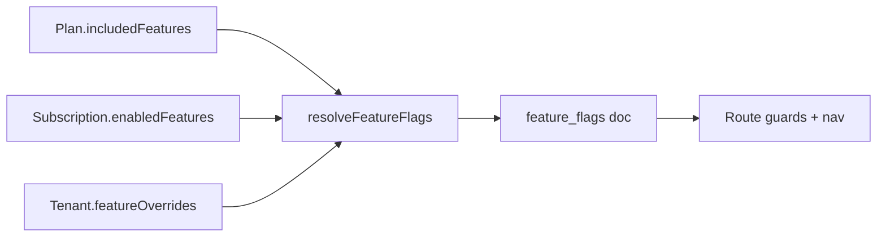

# Feature Toggle Architecture

## Feature Keys

Defined in `@ai-school/shared` → `FEATURE_KEYS`:

`attendance`, `timetable`, `homework`, `notices`, `results`, `fees`, `social_feed`, `events`, `photo_gallery`, `bus_tracking`, `ai_chatbot`, `online_classes`, `analytics`, `reports`, `push_notifications`, `whatsapp_alerts`, `ai_translations`, `multi_language`

## Resolution Pipeline

## Enforcement Layers

| Layer | Mechanism |
|-------|-----------|
| **Billing** | Subscription must be `active` or `trialing` |
| **Backend** | Cloud Functions check before AI/WhatsApp |
| **Firestore** | Rules don't gate features (membership only) |
| **Client** | Hide nav items; redirect if disabled |
| **API** | Railway returns 403 if feature off (via Functions proxy) |

## Caching

Cloud Function or scheduled job writes resolved flags to `feature_flags/{tenantId}` for fast client reads.

## White-Label

Tenants with `isWhiteLabel: true` use custom branding; feature set unchanged unless overridden.

## Multi-Language

`multi_language` feature enables locale switcher; `ai_translations` enables Railway translate endpoint.
