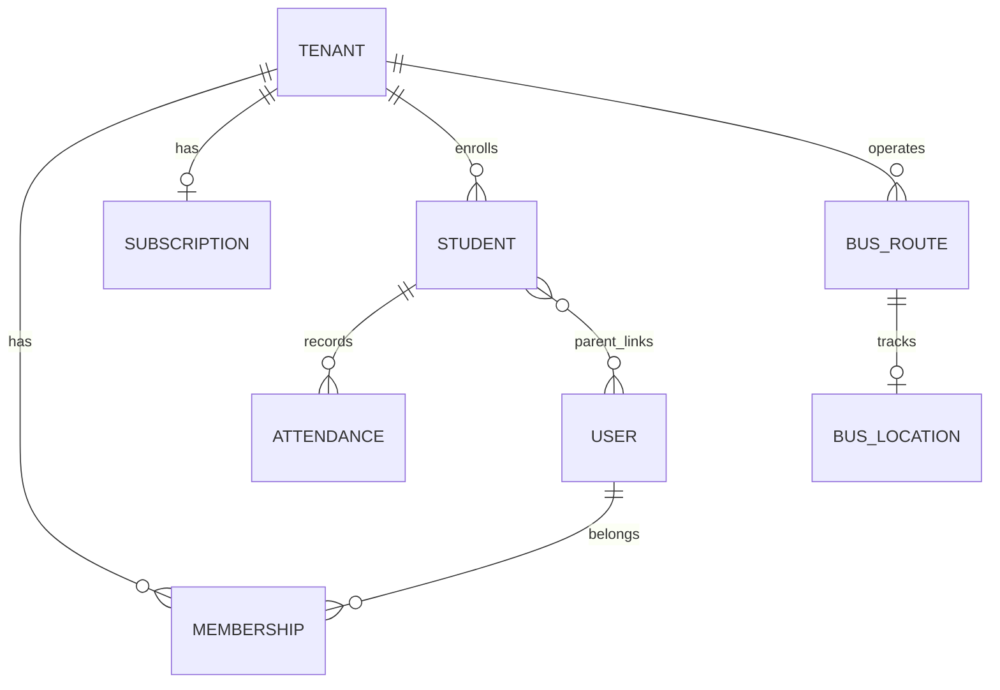

# Database Schema

## Entity Relationship (Logical)

## Core Tables (Firestore Collections)

### Platform

| Collection | Document ID | Key Fields |
|------------|-------------|------------|
| `tenants` | `{tenantId}` | name, slug, countryCode, currency, branding, locale |
| `plans` | `{planId}` | name, includedFeatures, defaultStudentSlabs |
| `country_pricing` | `{countryCode}` | currency, basePrice, studentSlabs, featurePrices |

### Identity

| Collection | Document ID | Key Fields |
|------------|-------------|------------|
| `users` | `{uid}` | phone, displayName, fcmTokens, activeTenantId |
| `memberships` | `{uid}_{tenantId}` | role, permissions, isActive, branchIds |
| `otp_sessions` | `{sid}` | phone, expiresAt (Functions-only) |

### Academic

| Collection | Key Fields |
|------------|------------|
| `students` | tenantId, grade, sectionId, parentIds, loginMode |
| `attendance` | tenantId, studentId, date, status |
| `homework` | tenantId, classId, dueDate |
| `notices` | tenantId, targetRoles, publishedAt |
| `results` | tenantId, studentId, examId, marks |
| `fees` | tenantId, studentId, amount, status |

### Engagement

| Collection | Key Fields |
|------------|------------|
| `feed_posts` | tenantId, authorId, content, mediaUrls |
| `events` | tenantId, startAt, endAt |
| `galleries` | tenantId, eventId, photoCount |
| `online_classes` | tenantId, meetingUrl, scheduledAt |

### Transport

| Collection | Key Fields |
|------------|------------|
| `bus_routes` | tenantId, driverId, stops[] |
| `bus_locations` | routeId (doc), lat, lng, updatedAt |

### Billing

| Collection | Key Fields |
|------------|------------|
| `subscriptions` | tenantId, planId, status, enabledFeatures |
| `payment_intents` | tenantId, provider, amount |
| `webhook_events` | provider, type, processed |

## Student Login Mode (Derived)

| Grade | loginMode | Auth |
|-------|-----------|------|
| Nursery–4 | `parent_only` | Parent account |
| 5–8 | `optional` | Parent default; student if linked |
| 9+ | `full` | Student account required |

Computed via `@ai-school/shared` → `getStudentLoginMode(grade)`.
