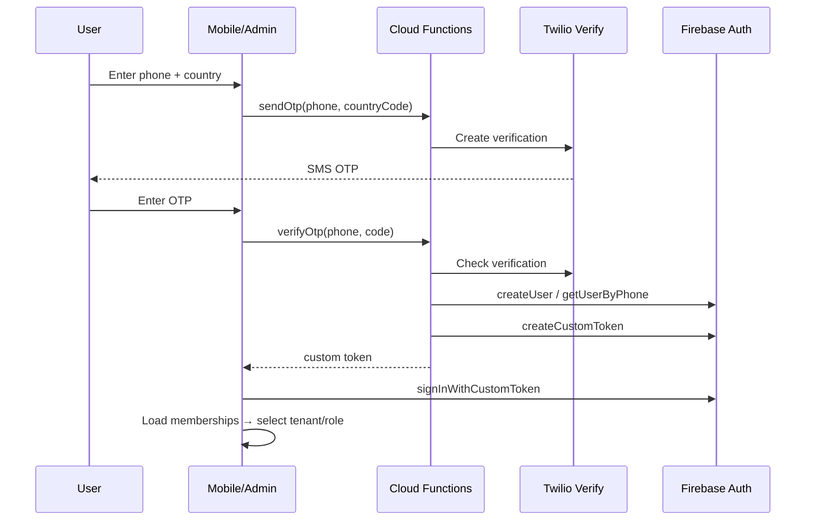

# User Flows

## 1. OTP Login (All Roles)

## 2. School Onboarding

1. Super admin creates `tenants/{id}`
2. School admin receives invite link (phone OTP)
3. Admin selects plan → live price calculator
4. Checkout via Stripe (global) or Razorpay (IN)
5. Webhook activates `subscriptions/{tenantId}`
6. Feature flags resolved → modules unlocked

## 3. Parent Views Child Attendance

1. Parent logs in (OTP)
2. App loads linked students via `parentIds`
3. Queries `attendance` where `studentId in [...]`
4. Push notification on new attendance record (FCM trigger)

## 4. Driver Bus Tracking

1. Driver logs in → role = `driver`
2. Opens bus tracking → streams GPS
3. Calls `updateBusLocation` callable
4. Writes `bus_locations/{routeId}`
5. Parents subscribe to route → map updates in real-time

## 5. Student Login (Grade Rules)

| Grade | Flow |
|-------|------|
| Nursery–4 | Parent only — no student OTP |
| 5–8 | School links optional `userId` on student |
| 9+ | Student must complete OTP login |

## 6. AI Assistant

1. User opens AI chat (feature flag: `ai_chatbot`)
2. App → Railway `POST /api/v1/chat` with API key
3. Context: role, language, tenantId
4. Response displayed; session stored in `ai_sessions`

## 7. Subscription Upgrade

1. Admin opens Subscription page
2. Adjusts student count + feature toggles
3. `calculatePrice` callable returns quote
4. `createCheckoutSession` → Stripe/Razorpay
5. Webhook → subscription status `active`
